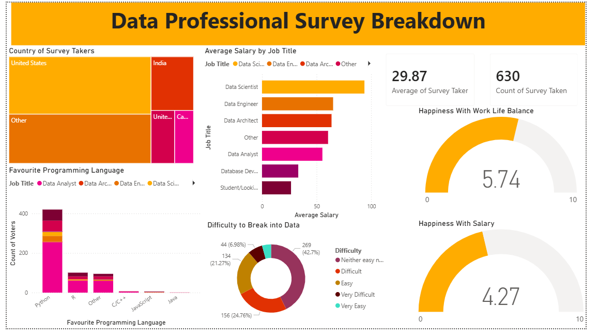

# Data_Professional_Survey_Dashboard
Developed an interactive survey dashboard using Power BI to analyze responses from data professionals.
The project involved data cleaning and transformation in Power Query, creation of DAX measures for advanced analytics, and implementation of interactive features such as drill-downs, grouping, and conditional formatting. The dashboard visualizes key trends, patterns, and insights from survey data, enabling stakeholders to make data-driven decisions efficiently.

# Skills Gained:
-Data Cleaning & Transformation: Handling missing values, formatting inconsistent data in Power Query.
-Data Modeling & DAX: Creating calculated columns, measures, and aggregations using DAX.
-Visualization & Storytelling: Designing insightful charts, tables, and KPIs with conditional formatting and grouping.
-Interactivity: Implementing drill-downs, slicers, and filters for user-driven exploration.
-Analytical Thinking: Extracting actionable insights from survey data and identifying trends.

# Dashboard Preview:

# Insights Generated:
-Identified the most common tools and skills among data professionals is Python.
-Highlighted demographic patterns and skill distribution across roles and experience levels.
-Revealed key trends in career preferences and industry adoption.

# Tools & Technologies:
-Power BI (for visualization, dashboards, and DAX calculations)
-Power Query (for data cleaning and transformation)
-DAX (for calculations and measures)
-Excel / CSV (data source management)
